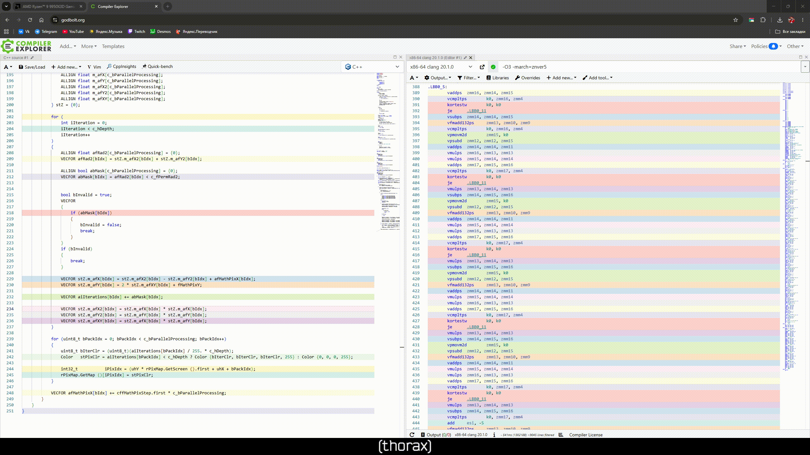

# Исследование x86 SIMD инструкций

## Введение

Цель данной работы - знакомство с `SIMD` (Single Instruction, Multiple Data) инструкциями. Практическая цель - оптимизация вычисления множества Мандельброта. Ниже также приведены результаты проведенных мной бенчмарков.

### Реализации
- `Stupid` - наивная реализация без оптимизаций. Выполняет простой попиксельный перебор
- `AVX` - реализация с поддержкой `AVX2`. Выполняет параллельный перебор по 8 пикселей
- `Adaptive` - реализация, основанная на оптимизации компилятором. Данные уложены в массивы специфичной длины. В данном случае использовались массивы `512 бит`, что позволило компилятору задействовать `AVX512`. Выполняется параллельный перебор по 16 пикселей

## Сборка
Для сборки потребуется (версии указанны для репрезентативности бенчмарков):
| Имя | Версия |
|---------|----------|
| `CMake` | 3.15 |
| `Clang++` | 20.1.8 |
| `Raylib` | 5.5 |

### Настройки 


### Сборка:
```bash
cmake -B build -DCMAKE_BUILD_TYPE=Release -DALGORITHM=ADAPTIVE -DGUI=OFF
cmake --build build
```
| Параметр | Описание |
|---------|----------|
| `DALGORITHM` | Устанавливает выбранную реализацию |
| `-DGUI` | Включает/выключает графический режим |

## Графический режим
В данном режиме можно "попутешествовать" по множеству. Управление:
| Клавиша | Описание |
|---------|----------|
| `W/UP` | Движение камеры вверх |
| `A/LEFT` | Движение камеры влево |
| `S/DOWN` | Движение камеры вниз |
| `D/RIGHT` | Движение камеры вправо |
| `MWHEELUP` | Приближение камеры |
| `MWHEELDOWN` | Отдаление камеры |
| `SPACE` | Вернуться в начальную позицию |
| `1` | Переместиться к точке {0.349375, 0.512087, 16833.265625} (X, Y, ZOOM)|
| `2` | Переместиться к точке {-0.549938, 0.625749, 12395.225586} (X, Y, ZOOM) |
| `3` | Переместиться к точке {-0.989273, 0.299529, 4522.115234} (X, Y, ZOOM) |
| `4` | Переместиться к точке {-1.243752, 0.116213, 21406.693359} (X, Y, ZOOM) |

Все перемещения в предложенные точки выполняются с использованием линейной интерполяцией

## Бенчмаркинг
### Кратко
Тесты выполнялись в статичных условиях без графики. Тестовая точка - центр множества {-0.8, 0.0, 0.8}. Предмет измерения - время кадра

### Характеристики тестового окружения
Тесты проводились на машине со следующими характеристиками:
- `Ryzen 9 9950x3D`
- `32Gb DDR5 6400MHz 32-39-39-76 CR2`

ОС: `Debian 13.5.0 trixie` - отдельный образ (настроен специально для бенчмарков), без следов чего либо лишнего

Более подробные характеристики, бенчмарки и конфигурация системы может быть предоставлена по запросу

### Подготовка
Для ограничения частоты процессора использовалась утилита `cpupower`. Частота фиксировалась на уровне `5.7 ГГц`
```bash
sudo cpupower frequency-set -d <frequency>
sudo cpupower frequency-set -u <frequency>
```

Во избежание вытеснения потока с ядра процессора используем `taskset`
```bash
taskset -c <core number>
```

Также время измерялось с помощью `clock_gettime (CLOCK_THREAD_CPUTIME_ID, ...);`, что точно исключает влияния планировщика ОС на измерения.
### Параметры сборки
|||
|---------|----------|
| Компилятор | `Clang++ 20.1.8` |
| Флаги | `-O3 -march=znver5` |
| Конфигурация | `NOGUI` |

### Результаты
Бенчмарк заключался в отрисовки `1000` кадров на время. Тест повторялся по `16` раз. В конце подсчитывалось:
- Общее время исполнения на ядре
- Среднее время кадра
- Дисперсия времени кадра
- Среднее кол-во кадров в секунду

Подробные результаты измерений приведены в `logs/`. Прирост в производительности оказался следующим:

| Реализация | Время исполнения | Среднее время кадра | Дисперсия | Средний FPS | Прирост X |
|---------|----------|----------|----------|----------|----------|
| `Stupid` | 915186ms | 57.1992ms | -0.184118ms | 17.4828 | 1 |
| `AVX` | 159694ms | 9.98088ms | 0.121917ms | 100.192 | 5.73 |
| `Adaptive(16)` | 85128.3ms | 5.32052ms | 0.147948ms | 187.952 | 10.75 |
| `Adaptive(32)` | 59168.9ms | 3.69806ms | 0.0112432ms | 270.412 | 15.47 |
| `Adaptive(64)` | 59700ms | 3.73125ms | 0.0623077ms | 268.007 | 15.33 |
| `Adaptive(128)` | 85037ms | 5.31481ms | 0.270227ms | 188.153 | 10.76 |

### Подтверждение корректности оптимизаций
Действительно компилятор, приняв флаг `-march=znver5`, корректно его обработал и добавил инструкции из набора `AVX512`, что видно на следующем фрагменте, записанном на `godbolt.org`. Аналогично были проверены все остальные реализации
